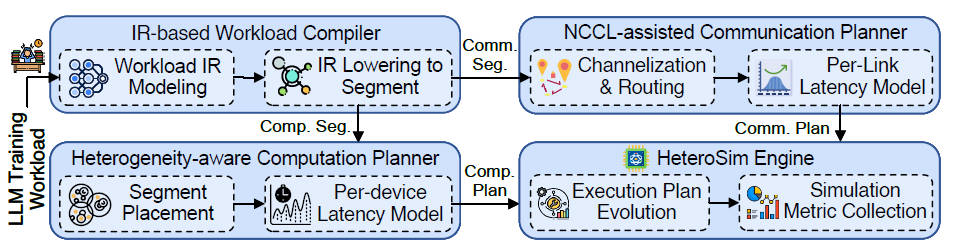
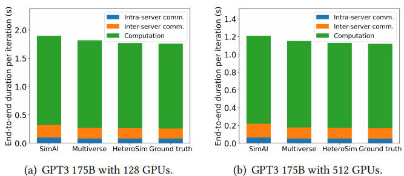

# HeteroSim

### Overview

**HeteroSim** is a GPU-accelerated simulation framework for high-fidelity, large-scale heterogeneous language model (LLM) training.  
It enables accurate, scalable, and data-driven emulation of distributed AI systems composed of diverse GPUs, interconnects, and communication backends.  

By integrating computation, communication, and scheduling into a unified simulation engine, HeteroSim achieves sub-percent simulation error and supports the exploration of new system architectures, parallel strategies, and network configurations under realistic heterogeneous environments.

---

### Core Innovations

- **IR-Based Workload Compiler**  
  Compiles model definitions, parallel strategies, and training schedules into a unified intermediate representation (IR), enabling precise mapping of computation and communication events.

- **Heterogeneity-Aware Computation Planner**  
  Dynamically allocates workloads based on GPU performance, topology bandwidth, and memory hierarchy, maximizing system efficiency in mixed-generation GPU clusters.

- **NCCL-Assisted Communication Planner**  
  Provides accurate modeling of hierarchical collective operations (e.g., all-reduce, broadcast) across NVLink, PCIe, and RoCE fabrics, ensuring consistency with real-world NCCL performance.

---

### System Architecture

HeteroSim adopts a **three-layer data-oriented design** to couple model semantics with system dynamics efficiently:

1. **Workload Layer**：Parses model graphs, parallelization strategies, and batch configurations, then compiles them into IR.  
2. **Execution Plan Layer**： Generates optimized execution schedules considering device heterogeneity, interconnect topology, and communication strategies.  
3. **Simulation Engine Layer**：Executes the unified plan in a fully GPU-accelerated environment, jointly simulating computation, synchronization, and data movement.  

### Benchmarking

Under the balanced H2 setting, HeteroSim achieves a Mean Absolute Percentage Error of about 0.6% on pre-iteration training time for GPT-3-175B. The breakdown tracks ground truth closely and preserves the expected increase of inter-server share as scale grows. The improvement comes from message-granular NCCL replay, calibrated per-type link models, and heterogeneity-aware placement that keeps natural compute-communication overlap.

HeteroSim sustains sub-percent error across H0 to H4 for both workloads. The gap to baselines widens in PCIe-heavy and RoCE-heavy regimes where cross-node collectives dominate.

| Workload   | H0   | H1   | H2   | H3   | H4   |
|------------|-----:|-----:|-----:|-----:|-----:|
| LLaMA-65B  | 0.61 | 0.72 | 0.93 | 1.07 | 1.12 |
| GPT-3-175B | 0.69 | 0.91 | 1.03 | 1.11 | 1.24 |

### References

+ [**SimAI: Unifying Architecture Design and Performance Tuning for Large-Scale Large Language Model Training with Scalability and Precision**](https://www.usenix.org/conference/nsdi25/presentation/wang-xizheng-simai).  
  Xizheng Wang, Qingxu Li, Yichi Xu, Gang Lu, Dan Li, Li Chen, Heyang Zhou, Linkang Zheng, Sen Zhang, Yikai Zhu, Yang Liu, Pengcheng Zhang, Kun Qian, Kunling He, Jiaqi Gao, Ennan Zhai – *NSDI 2025.*

+ [**Multiverse: Accelerating Design Space Exploration for LLM Training Systems with Multi-experiment Parallel Simulation**](https://www.usenix.org/conference/nsdi25/presentation/gui).  
  Fei Gui, Kaihui Gao, Li Chen, Dan Li, Vincent Liu, Ran Zhang, Hongbing Yang, Dian Xiong – *NSDI 2025.*

+ [**Astra-sim2. 0: Modeling hierarchical networks and disaggregated systems for large-model training at scale**](https://arxiv.org/pdf/2303.14006).  
  William Won, Taekyung Heo, Saeed Rashidi, Srinivas Sridharan, et al. – *Arxiv 2023.*

+ [**ns-3: Discrete-Event Network Simulator**](https://www.nsnam.org/).  
  Tom Henderson, Mathieu Lacage, George Riley – *SIGCOMM Demo 2008.*

+ [**GShard: Scaling Giant Models with Conditional Computation and Automatic Sharding**](https://arxiv.org/abs/2006.16668).  
  Noam Shazeer, Zhenzhong Lan, Youlong Cheng, Nan Ding – *NeurIPS 2021.*

+ [**DCQCN: Congestion Control for Large-Scale RDMA Deployments**](https://dl.acm.org/doi/10.1145/2785956.2787484).  
  Yibo Zhu, Haggai Eran, Daniel Firestone, Chuanxiong Guo, Marina Lipshteyn, et al – *SIGCOMM 2015.*

 

